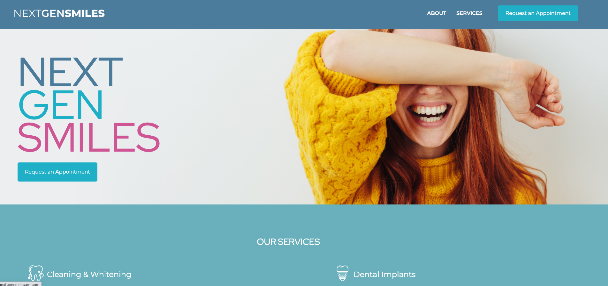
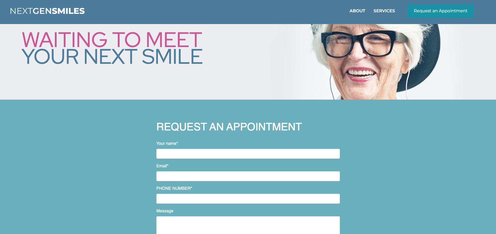

# Next Gen Smile Care

Responsive website for dental practice, featuring a list of services, testimonials, and contact form. Worked closely with client and designer on information architecture and UX prior to development. Utitlized Sketch to develop pixel-perfect website. Also developed animated banner ads and email.

Live demo [_here_](http://nextgensmilecare.com/)

## Technologies Used

- React
- React Router
- React Bootstrap
- EmailJS
- Google maps

## Hosted on

- GoDaddy

## Features

- Carousel with testimonials
- request appointment form using emailjs
- Routing with react router

## Landing Page

## Request Appointment Form

## Contact

Created by [@cfrancisco726](http://www.carlofrancisco.com) - feel free to contact me!
